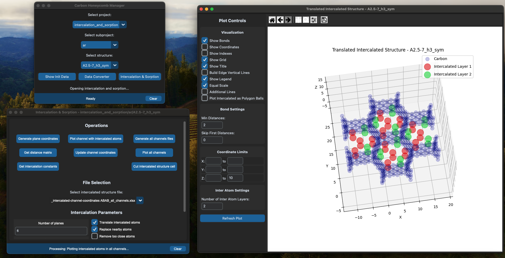

# Carbon Honeycomb Manager

> A scientific desktop application for modeling and analyzing carbon honeycomb nanostructures with intercalation capabilities



## 🎯 Project Overview

This application is a comprehensive tool for computational modeling of carbon honeycomb nanostructures, specifically designed for research in materials science and nanotechnology. It enables researchers to visualize, analyze, and simulate atomic-scale interactions in carbon-based nanomaterials, including intercalation processes with noble gases and other elements.

**Key Achievement**: Implements advanced channel analysis algorithms for precise placement of intercalated atoms within hexagonal carbon lattice structures, enabling simulation of gas sorption and storage phenomena at the nanoscale.

## ✨ Core Features

### 🔬 Scientific Capabilities

- **3D Molecular Structure Visualization**: Interactive visualization of carbon honeycomb lattices with real-time manipulation (rotation, zoom, pan)
- **Intercalation Modeling**: Automated placement of atoms (Ar, Kr, Xe, etc.) within carbon nanotube channels with configurable layer spacing
- **Channel Analysis**:
  - Automatic detection and characterization of hexagonal channels
  - Distance-to-plane and distance-to-edge calculations
  - Channel geometry analysis (angles, lengths, diameters)
- **Structure Translation & Transformation**: Coordinate system manipulation and structure alignment tools
- **Multi-Format Support**: Import/export data in `.pdb`, `.dat`, and `.xlsx` formats
- **Batch Processing**: Process multiple structures and generate comparative analysis

### 💻 Technical Achievements

- **Clean Architecture**: Strict MVP (Model-View-Presenter) pattern with complete interface segregation
- **Type-Safe Codebase**: Full type annotations throughout the application using Python protocols and abstract classes
- **State Persistence**: Automatic saving/loading of application state and visualization parameters
- **Real-Time Parameter Binding**: Bidirectional synchronization between UI controls and computational models
- **Advanced UI Components**:
  - Custom scrollable interfaces with touchpad/keyboard support
  - Embedded Matplotlib with interactive controls
  - Dark/light theme support with centralized styling system
- **Modular Design**: Service-oriented architecture with clear separation of concerns

## 🛠️ Technology Stack

### Core Technologies

- **Python 3.x** - Primary development language
- **CustomTkinter** - Modern GUI framework with native theming
- **NumPy** - High-performance numerical computations and array operations
- **Matplotlib** - Scientific visualization and 3D plotting
- **Pandas** - Data manipulation and analysis

### Scientific Computing

- **MDAnalysis** - Molecular dynamics trajectory analysis
- **OpenPyXL** - Excel file manipulation for data export

### Architecture & Patterns

- **MVP Architecture** - Complete separation of concerns with interface contracts
- **Protocol-Oriented Design** - Type-safe abstractions using Python protocols
- **Factory Pattern** - Dynamic object creation for UI components
- **Observer Pattern** - Event-driven parameter synchronization

### Development Tools

- **Pylance/Pyright** - Static type checking and linting
- **PyInstaller** - Standalone application builds for macOS/Windows

## 🏗️ Architecture Highlights

```
📁 Project Structure (Simplified)
├── src/
│   ├── mvp/                    # MVP implementations (4 modules)
│   ├── interfaces/             # Complete interface contracts
│   │   ├── mvp/               # View/Model/Presenter protocols
│   │   └── services/          # Service layer protocols
│   ├── projects/              # Domain logic
│   │   ├── intercalation_and_sorption/  # Core algorithms
│   │   └── carbon_honeycomb_actions/    # Structure operations
│   ├── services/              # Utilities
│   │   ├── coordinate_operations/       # Geometric calculations
│   │   ├── structure_visualizer/        # 3D rendering
│   │   └── utils/                       # File I/O, logging
│   └── ui/                    # UI infrastructure
│       ├── components/        # Reusable widgets
│       └── styles/            # Centralized theming
```

**Key Architectural Decisions:**

- Interface-first development ensuring loose coupling
- Dataclass-based parameter management for type safety
- Service layer abstraction for testability
- Template inheritance for UI consistency

## 🚀 Getting Started

### Prerequisites

- Python 3.8+
- pip package manager

### Installation

```bash
# Clone the repository
git clone <repository-url>
cd carbon_honeycomb_manager

# Install dependencies
pip install -r requirements.txt

# Run the application
python main.py
```

### Building Standalone Executables

```bash
# macOS
./build_app_for_mac.sh

# Windows
build_app_for_windows.bat
```

## 📊 Use Cases

1. **Materials Science Research**: Simulate gas storage in carbon nanotubes
2. **Nanotechnology**: Analyze atomic-scale structural properties
3. **Computational Chemistry**: Visualize and manipulate molecular structures
4. **Educational**: Demonstrate nanoscale phenomena in teaching contexts

## 🎓 Academic Context

This tool supports research in:

- Gas sorption and storage in nanomaterials
- Intercalation phenomena in layered structures
- Honeycomb lattice geometry analysis
- Molecular dynamics preparation and analysis

## 📝 Development Features

- **Development Mode**: Detailed error tracebacks and debugging info (set `DEV_MODE=true` in `.env`)
- **Logging System**: Comprehensive logging for debugging and analysis
- **Configuration Management**: JSON-based parameter persistence
- **Extensible Design**: Easy addition of new molecular structures and analysis types

## 🔬 Technical Deep Dive

The intercalation algorithm implements:

- Voronoi-based channel detection
- Lattice vector calculation for hexagonal geometries
- Layer-by-layer atom placement with collision detection
- Coordinate transformation and translation matrices
